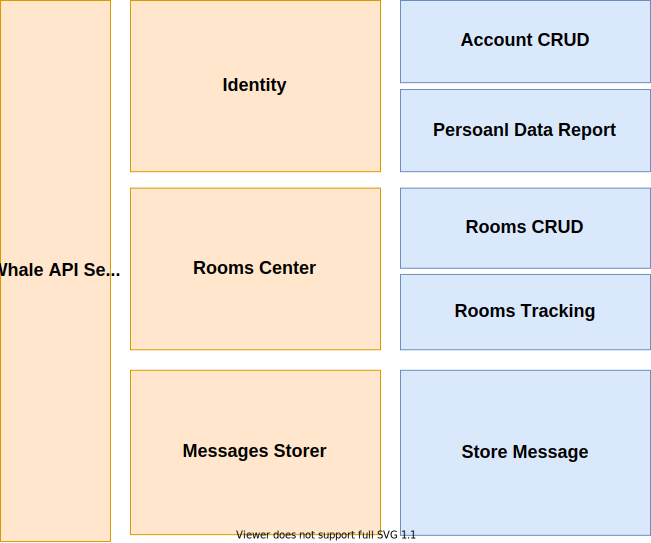
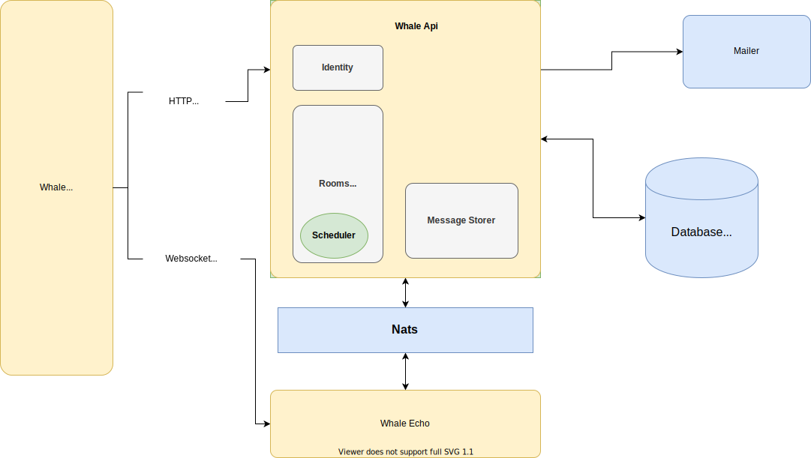
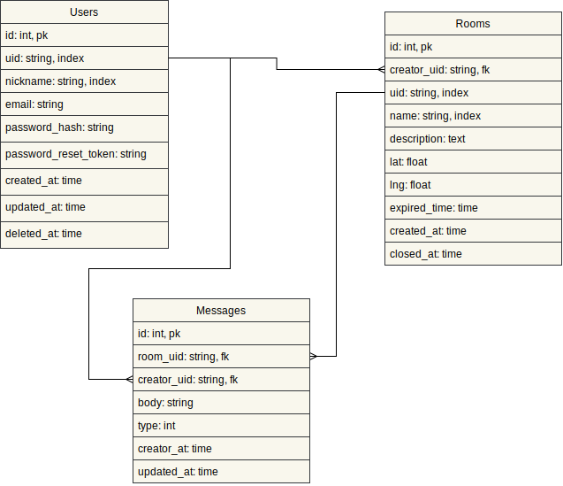

# WhaleApi Server

WhaleApi is http api server for whale application.

## Table of Content

1.  Installation
2.  **[System Design](#system-design)**

## System Design

#### Domain Structure Diaram

#### System Architecture Diagram

#### Entity Relationship Diagram

